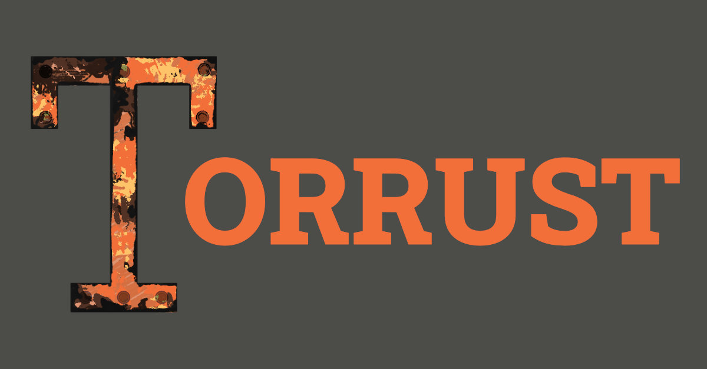

#

## Index

---

- [PROJECT DESCRIPTION](#project-description)
- [RECENT IMPROVEMENTS](#recent-improvements)
- [USAGE BENCHMARKS](#usage-benchmarks)
- [ROADMAP](#roadmap)
- [TECHNOLOGIES](#technologies)
- [ORIGIN](#origin)
- [LICENSING](#licensing)
- [TEAM](#team-🙋‍♀️)
- [CONTRIBUTING](#contributing)
- [DOCUMENTATION](#documentation-pagewithcurl-barchart)
- [CONTACT](#contact)

---

## Project Description

---

__Torrust__ is an open source project that aims to provide you with the tools you need to host your own torrent indexes with ease.

With Torrust you will get a private and public tracker option in addition to web application for uploading and downloading torrents, tracked in the Torrust tracker.

The Torrust name is a combination of Torrent and Rust.
We have a focus on speed, safety and concurrency which is why we use the [Rust](https://www.rust-lang.org/) programming language.

The benefit from Torrust is that Anyone is able to host a (private) BitTorrent tracker and online torrent index with ease to share their digital content!

### Current Features

- [X] User authentication
- [X] E-mail verification
- [X] Torrent sharing
- [X] Torrent searching & filtering
- [X] Private tracker compatible
- [X] Content & user moderation tools
- [X] Website customization

### Project Structure

- [__Backend__](https://github.com/torrust/torrust/tree/main/backend): A REST API written in Rust with the Actix web framework that acts as a backend for the web application.

- [__Frontend__](https://github.com/torrust/torrust/tree/main/frontend): A Vue application that acts as a frontend for the web application.

- [__Torrust Tracker__](https://github.com/torrust/torrust-tracker): A UDP and HTTP based torrent tracker built with Rust.

- [__Torrust Documentation__](https://github.com/torrust/torrust-documentation): A website made with MkDocs that hosts all the Torrust documentation.

---

## Recent Improvements

### Significant changes from the last 3 months (2022-06)

- Massively sped up the tracker requests/s rate in private and whitelisted mode
- Added support for multiple UDP and HTTP server blocks
- Added full support for IPV6 peers for both UDP and HTTP
- Added support to the tracker for multple database driver implementations
- Added tracker statistics
- Optimized some of the tracker's memory usage. Cut about 50% memory usage compared to the previous version while not sacrificing any performance.
- Improved UI/UX of the index

---

## Usage Benchmarks

*Coming soon.*

---

## Roadmap

*Coming soon.*

---

## Technologies

Almost all our work is in [Rust](https://www.rust-lang.org/).

"Rust is a modern systems programming language focusing on __safety__, __speed__, and __concurrency__."

---

## Licensing 🧾

The different repositories may have one or more licenses. These licenses can be found in a markdown file called "LICENSE.md"  in the main folders. In addition to this file, you may also find a folder called "Licensing". This folder is common when there is more than one applicable license. This can be the case when there is for example code and media in the same repository.

The current license are based on [Nautilus Cyberneering](https://nautilus-cyberneering.de/) repository licenses and are applicable to all Torrust projects.

Essentially they are [AGPL 3.0](https://www.gnu.org/licenses/agpl-3.0.en.html) for code with some additional licenses dependent on the code's contribution "age".

More here: <https://github.com/torrust/torrust-index/blob/main/LICENSE>

---

## Team 🙋‍♀️

We are currently a growing small team of contributors developing Torrust. Some of us are contributing for free and others are employed by our main sponsor [Nautilus Cyberneering](https://nautilus-cyberneering.de/).

We are always looking for help and believe that everyone can add value.

---

## Contributing

Torrust is an Open Source project so anyone interested in contributing can do so.

We are looking for proactive, passionate and active contributors and if you are one we will notice you. It is very easy in an Open Source project.

Your contributions can take many forms, working code, new ideas for features, constructive comments in discussions, revisions, improvement suggestions, etc.

Also if you make qualitative contributions that help the team move the project forward these will speak for themselves and our sponsor [Nautilus Cyberneering](https://nautilus-cyberneering.de/) will notice you.

---

## Sponsoring

This project came to be since our current main sponsor [Nautilus Cyberneering](https://nautilus-cyberneering.de/), needed a solution that makes it easy for anyone with a computer and internet connection to share their files with the rest of the world.

You can become a sponsor too so we can grow Torrust together. If you are interested please contact us or follow our [sponsoring link]().

---

## Contact

If you have any issues and suggestions please feel free to contact us via:

Message `Warm Beer#3352` on Discord or email `mick@dutchbits.nl`.

or

[Create an issue](https://github.com/torrust/torrust-index/issues)

---

## Credits

This project was developed by [Dutch Bits](https://dutchbits.nl) for [Nautilus Cyberneering GmbH](https://nautilus-cyberneering.de/).

The project has been possible through the support and contribution of both Nautilus Cyberneering, its team and collaborators, as well as that of our great open source contributors. Thank you to you all!

<!--

**Here are some ideas to get you started:**

🙋‍♀️ A short introduction - what is your organization all about?

🌈 Contribution guidelines - how can the community get involved?

💻 Useful resources - where can the community find your docs? Is there anything else the community should know?

🍿 Fun facts - what does your team eat for breakfast?

🧙 Remember, you can do mighty things with the power of [Markdown](https://docs.github.com/github/writing-on-github/getting-started-with-writing-and-formatting-on-github/basic-writing-and-formatting-syntax)
-->
